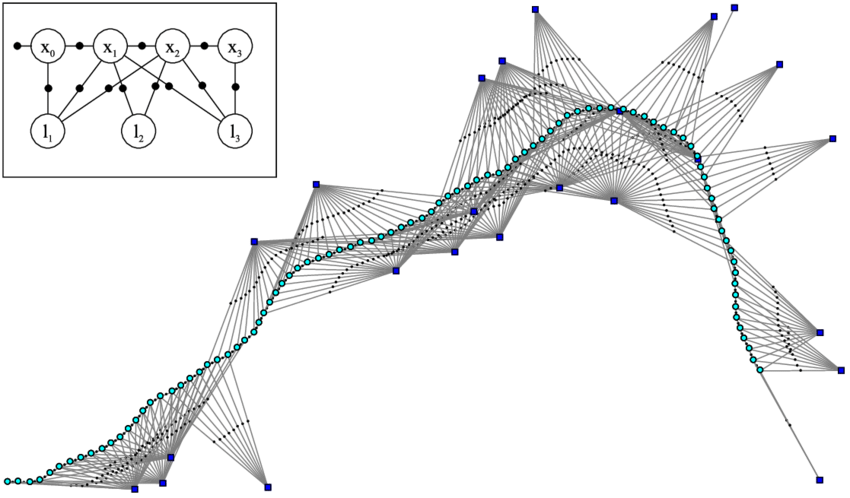

```{r setup, include=FALSE}
knitr::opts_chunk$set(echo = TRUE, prompt=TRUE, comment='')
```

## R Markdown

This is an R Markdown document. Markdown is a simple formatting syntax for authoring HTML, PDF, and MS Word documents. For more details on using R Markdown see <http://rmarkdown.rstudio.com>.

When you click the **Knit** button a document will be generated that includes both content as well as the output of any embedded R code chunks within the document. You can embed an R code chunk like this:

```{r cars}
summary(cars)
```

```{r prompt=FALSE, tidy=TRUE}
s <- 0
for(x in 1:5) {s <- s + x^x; print(s)}
```

```{r collapse=TRUE}
sin(pi/2)
cos(pi/2)
```

```{r fig.width=10/2.54, fig.height=10/2.54}
curve(exp(-0.1*x)*sin(x), 0, 4*pi)
abline(h=0, lty=3)
```

## Including Plots

You can also embed plots, for example:

```{r pressure, echo=FALSE}
plot(pressure)
```

Note that the `echo = FALSE` parameter was added to the code chunk to prevent printing of the R code that generated the plot.

## Test

$$f(k) = C^k_n p^{k} (1-p)^{n-k}$$

```{r}
names(knitr::knit_engines$get())

knitr::kable(iris[1:5, ], caption = 'A caption')
```

```{bash, echo=FALSE}
pwd
```


## Octave

```{octave}
x = 0:pi/100:2*pi;
y = sin(x);

figure
plot(x,y)
```


## TikZ picture

- Here is a TikZ picutre

\begin{tikzpicture}
\draw (0,0) circle (2cm);
\end{tikzpicture}

- Here is another TikZ picutre

\begin{tikzpicture}
\begin{axis}[xmax=9,ymax=9, samples=50]
  \addplot[blue, ultra thick] (x,x*x);
  \addplot[red,  ultra thick] (x*x,x);
\end{axis}
\end{tikzpicture}

- factor graph

\begin{tikzpicture}[roundnode/.style={circle, fill=black!60, inner sep=0pt, minimum size=4mm}]

    \foreach \i [count=\ni] in {120, 60, ..., -180}
        \node[roundnode, label=\i:{$u_\ni$}] at (\i:2cm) (u\ni) {};

            %Lines
            \draw[->] (u2) -- (u5);
            \draw[->] (u2) -- (u6);
            \draw[->] (u3) -- (u5);
            \draw[->] (u3) -- (u6);
            \draw[->] (u4) -- (u5);
            \draw[->] (u4) -- (u6); 
\end{tikzpicture}

\begin{tikzpicture}[roundnode/.style={draw,shape=circle,fill=blue,minimum size=1mm}]
        %Nodes
        \node[circle,fill,inner sep=1pt,label={north west:$u_1$}]      (u1)                     {};
            \node[roundnode,label={north east:$u_2$}]      (u2)       [right=of u1] {};
            \node[roundnode,label={east:$u_3$}]      (u3)       [below right=of u2] {};
            \node[roundnode,label={south east:$u_4$}]      (u4)       [below left =of u3] {};
            \node[roundnode,label={south west:$u_5$}]      (u5)       [left =of u4] {};
            \node[roundnode, label={west:$u_6$}]      (u6)       [below left =of u1] {};
            %Lines
            \draw[->] (u2) -- (u5);
            \draw[->] (u2) -- (u6);
            \draw[->] (u3) -- (u5);
            \draw[->] (u3) -- (u6);
            \draw[->] (u4) -- (u5);
            \draw[->] (u4) -- (u6); 
\end{tikzpicture}

```{r}

```

