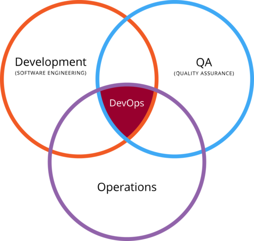

# DevOps

[](https://devops-cg.readthedocs.io/zh_CN/latest/?badge=latest)

-----

<p align="center">
  
</p>

## MkDocs

* [MkDocs](https://www.mkdocs.org/): Project documentation with Markdown.

  ```sh
  mkdocs build

  mkdocs serve
  ```
