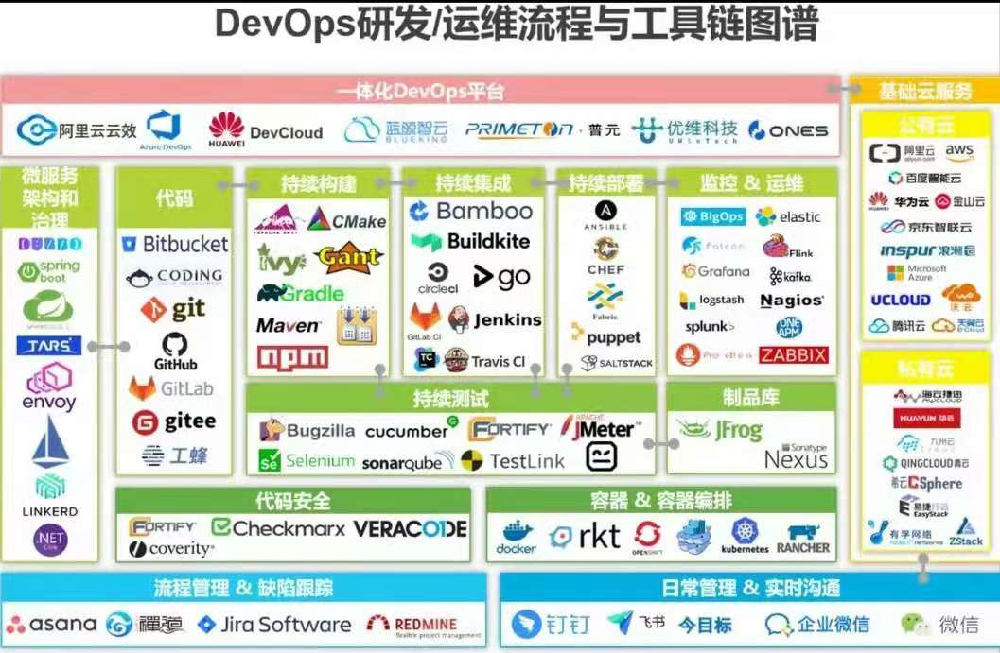

# DevOps

* [Google Code](https://code.google.com/)
* [谷歌开发者社区(GDG)](https://chinagdg.org/)

  

  

---

## Basics

## Languages

* C/C++
* Python
* Matlab
* R
* VB
* C#
* Java

## Scripting (Linux & Windows)

## App Build

* Compile

* Debug

* Reverse Engineering

* Docker

## CMS - Configuration Management System

## CMS - Content Management System

* [Kirby](https://getkirby.com/) is a file‑based CMS

* [Drupal](https://www.drupal.org/) is content management software.

## PKM - Personal Knowledge Management

## PMS - Package Management System

## Mailing

* [Grokbase](https://grokbase.com/) is a growing mailing list archive that facilitates discovery of discussions and users within and across groups

* [MarkMail](https://markmail.org/) is a free service for searching mailing list archives, with huge advantages over traditional search engines

* [git.net](http://git.net/)
