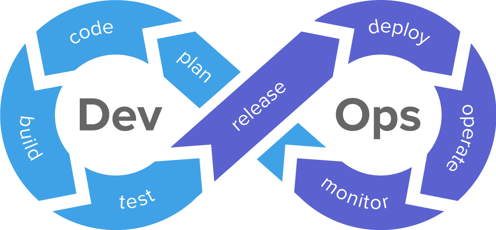

# DevOps

* [Google Code](https://code.google.com/)
* [谷歌开发者社区(GDG)](https://chinagdg.org/)

  

  

---

## 01. Basics

## 02. Languages

* C/C++
* Python
* Matlab
* R
* VB
* C#
* Java

## 02. Scripting (Linux & Windows)

## 03. App Build

* Compile

* Debug

* Reverse Engineering

* Docker

## 04. CMS - Configuration Management System

## 05. CMS - Content Management System

* [Kirby](https://getkirby.com/) is a file‑based CMS

* [Drupal](https://www.drupal.org/) is content management software.

## 06. PKM - Personal Knowledge Management

## 07. PMS - Package Management System

## 08. Network

## 09. Mailing

* [Grokbase](https://grokbase.com/) is a growing mailing list archive that facilitates discovery of discussions and users within and across groups

* [MarkMail](https://markmail.org/) is a free service for searching mailing list archives, with huge advantages over traditional search engines

* [git.net](http://git.net/)

## 10. Kids Coding

* [少儿编程网](http://www.kidscode.cn/)

* [beanz](https://www.kidscodecs.com/): A Magazine about Kids, Coding, and Computer Science

* [c-jump](http://www.c-jump.com/) helps children to learn basics of programming languages, such as C, C++ and Java.

* [Scratch](https://scratch.mit.edu/) is a free programming language and online community where you can create your own interactive stories, games, and animations

* [Code.org](https://code.org/) is a nonprofit dedicated to expanding access to computer science in schools and increasing participation by women and underrepresented minorities.
